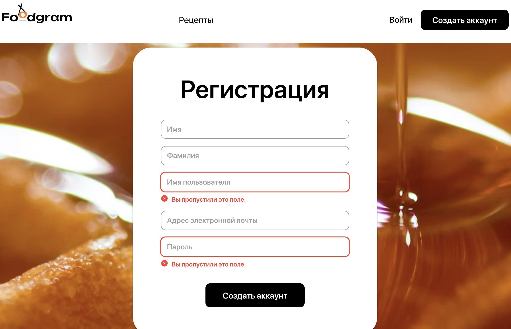

# Foodgram

## Описание

Представляю вам проект, созданный во время обучения в Яндекс Практикуме. Этот проект — часть учебного курса, но он создан полностью самостоятельно.

Цель этого сайта — дать возможность пользователям создавать и хранить рецепты на онлайн-платформе. Кроме того, можно скачать список продуктов, необходимых для приготовления блюда, просмотреть рецепты друзей и добавить любимые рецепты в список избранных.

Чтобы использовать все возможности сайта — нужна регистрация. Проверка адреса электронной почты не осуществляется, вы можете ввести любой email.

Заходите и делитесь своими любимыми рецептами!
<br>

## Стек технологий
**Python** — высокоуровневый язык программирования общего назначения с динамической строгой типизацией и автоматическим управлением памятью.

**Django** — свободный фреймворк для веб-приложений на языке Python, использующий шаблон проектирования MVC.

**Django REST framework (DRF)** — мощный набор инструментов для создания веб-сервисов и API на основе фреймворка Django. 

**Djoser** - REST-имплементация системы аутентификации для Django.

**PostgreSQL** — СУБД с открытым исходным кодом. Она поддерживает большую часть стандарта SQL и предлагает множество современных функций.


## Установка

Сайт Foodgram доступен по ссылке: https://effrafax.ru

Для того чтобы развернуть приложение на своем сервере проделайте следующие шаги:

1. Установите Docker Compose на свой сервер:
```
sudo apt update
sudo apt install curl
curl -fSL https://get.docker.com -o get-docker.sh
sudo sh ./get-docker.sh
sudo apt install docker-compose-plugin
```

2. Создайте дирректорию foodgram и в ней файлы docker-compose.production.yml .env:
```
mkdir foodgram
cd foodgram
touch docker-compose.production.yml
touch .env
```

3. Cкопируйте содержимое docker-compose.production.yml и .env.example из корневой директории https://github.com/EffrafaxStafford/foodgram.
Содержимое переменных окружения можете указать на свое усмотрение.

4. Для запуска Docker Compose в режиме демона выполните команду:
```
sudo docker compose -f docker-compose.production.yml up -d
```
5. Выполните миграции, соберите статические файлы бэкенда и скопируйте их в /backend_static/static/:
```
sudo docker compose -f docker-compose.production.yml exec backend python manage.py migrate
sudo docker compose -f docker-compose.production.yml exec backend python manage.py collectstatic
sudo docker compose -f docker-compose.production.yml exec backend cp -r /app/foodgram/collected_static/. /backend_static/static/
```
6. Загрузите данные из csv:
```
sudo docker compose -f docker-compose.production.yml exec backend python foodgram/csv_to_db.py
```
7. Для работы с админ-зоной, создайте суперпользователя:
```
sudo docker compose -f docker-compose.production.yml exec backend python manage.py createsuperuser
```
8. С помощью Nginx перенаправьте все запросы в докер и перезагрузите nginx:
```
sudo service nginx reload
```


## Возможности проекта

Проект состоит из следующих страниц: 
- главная,
- страница входа,
- страница регистрации,
- страница рецепта,
- страница пользователя,
- страница подписок,
- избранное,
- список покупок,
- создание и редактирование рецепта,
- страница смены пароля,
- статические страницы «О проекте» и «Технологии».

### Главная 
Содержимое главной — список первых шести рецептов, отсортированных по дате публикации «от новых к старым». На этой странице подразумевается постраничная пагинация. Остальные рецепты должны быть доступны на следующих страницах.


### Страница регистрации
В проекте доступна система регистрации и аутентификации пользователей.

Обязательные поля для пользователя при регистрации:
- имя,
- фамилия,
- имя пользователя (никнейм),
- адрес электронной почты,
- пароль.



### Страница входа
После регистрации пользователь переадресовывается на страницу входа.


### Статические страницы
Проект предусматривает две статические страницы: «О проекте» и «Технологии».


### Страница рецепта
Здесь — полное описание рецепта. Залогиненные пользователи могут добавить рецепт в избранное и список покупок, а также подписаться на автора рецепта.

Для каждого рецепта можно получить прямую короткую ссылку, нажав на соответствующую иконку справа от названия рецепта. Эта ссылка не меняется после редактирования рецепта.
Так выглядит иконка, которая отвечает за получение ссылки на рецепт


В большинстве браузеров, например на основе Chromium, ссылка автоматически скопируется в буфер обмена, а в Safari — выведется на экран в правом верхнем углу, откуда её можно скопировать в буфер обмена. Такое поведение реализовано в SPA-приложении.

### Страница пользователя
На странице — имя пользователя, все рецепты, опубликованные пользователем, и кнопка, чтобы подписаться или отписаться от него.


### Страница подписок
Только владелец аккаунта может просмотреть свою страницу подписок. Ссылка на неё находится в выпадающем меню в правом верхнем углу.


Сценарий перехода к странице подписок
Подписаться на публикации могут только залогиненные пользователи.
Сценарий поведения пользователя:
Пользователь переходит на страницу другого пользователя или на страницу рецепта и подписывается на публикации автора кликом по кнопке Подписаться на автора.
Пользователь переходит на страницу Мои подписки и просматривает список рецептов, опубликованных теми авторами, на которых он подписался. Записи сортируются по дате публикации — от новых к старым.
При необходимости пользователь может отказаться от подписки на автора. Тогда ему нужно перейти на страницу автора, его рецепта или на страницу своих подписок и нажать кнопку Отписаться.

### Избранное
Добавлять рецепты в избранное может только залогиненный пользователь.
Вид страницы избранного для залогиненного пользователя


Если незалогиненный пользователь попробует добавить рецепт в избранное, подписки или покупки, то приложение попросит его зарегистрироваться или войти в свой аккаунт.
Сценарий добавления рецепта в избранное
Сам список избранного может просмотреть только его владелец.
Сценарий поведения пользователя:
Пользователь отмечает один или несколько рецептов кликом по кнопке Добавить в избранное.
Пользователь переходит на страницу Избранное и просматривает свой список избранных рецептов.
При необходимости пользователь может удалить рецепт из избранного.

### Список покупок
Работать со списком покупок могут только залогиненные пользователи. Доступ к собственному списку покупок есть только у владельца аккаунта.
Сценарий поведения пользователя:
Пользователь отмечает один или несколько рецептов кликом по кнопке Добавить в покупки. Сделать это можно с главной страницы или со страницы рецепта.
Пользователь переходит на страницу Список покупок, там доступны все добавленные в список рецепты. Пользователь нажимает кнопку Скачать список и получает файл с перечнем и количеством необходимых ингредиентов для всех рецептов, сохранённых на странице Список покупок.
При необходимости пользователь может удалить рецепт из списка покупок.
Чтобы удалить рецепт из списка покупок, нужно нажать на иконку корзины рядом с ним
Пользователь может скачать свой список покупок в формате .txt.
Ингредиенты в скачанном списке не дублируются. Если в двух рецептах есть сахар (в одном рецепте 5 г, в другом — 10 г), в списке должен быть один пункт: Сахар — 15 г. То есть ингредиенты в списке покупок суммируются.
Сам список выглядит примерно так:

Список покупок:
- Фарш (баранина и говядина) (г) — 600
- Сыр плавленый (г) — 200
- Лук репчатый (г) — 50
- Картофель (г) — 1000
- Молоко (мл) — 250
- Яйцо куриное (шт.) — 5
- Соевый соус (ст. л.) — 8
- Сахар (г) — 230
- Растительное масло рафинированное (ст. л.) — 2
- Соль (по вкусу) — 4
- Перец чёрный (щепотка) — 3

### Создание и редактирование рецепта
Эта страница доступна только для залогиненных пользователей. Все поля на ней обязательны для заполнения. 
Сценарий поведения пользователя:
Пользователь переходит на страницу добавления рецепта, нажав на кнопку Создать рецепт в шапке сайта.
Пользователь заполняет все обязательные поля.
Пользователь нажимает кнопку Создать рецепт.
Также пользователь может отредактировать любой рецепт, который он создал.

### Страница изменения пароля
Доступ к этой странице есть только у залогиненных пользователей, через кнопку Сменить пароль в выпадающем меню в правом верхнем углу страницы.

### Фильтрация по тегам
Тег (от англ. tag, «метка», «бирка», «ярлык») — метка, которая классифицирует данные и помогает облегчить процесс поиска нужной информации в веб-приложении.
При добавлении рецепта обязательно указывается один или несколько тегов. Новые теги может добавить только администратор сайта.
На страницах с рецептами при нажатии на название тега выводится список рецептов, отмеченных этим тегом. Фильтрация может проводиться по нескольким тегам в комбинации «или»: если выбрано несколько тегов, в результате должны быть показаны рецепты, которые отмечены хотя бы одним из этих тегов. 
При фильтрации на странице пользователя фильтруются только рецепты выбранного пользователя. Такой же принцип должен соблюдаться при фильтрации списка избранного.

### Смена аватара
После регистрации новый пользователь получает изображение профиля по умолчанию.
При клике на аватар у пользователя в шапке сайта появляется возможность поменять его или удалить.


Если пользователь удалит собственное изображение, вместо него снова появится заглушка

### Разграничение прав
В проекте описаны разные уровни доступа пользователей:
- гость (анонимный пользователь),
- аутентифицированный (залогиненный) пользователь,
- администратор.


## Авторство
**Автор:** Лампежев А.Х.<br>
**Контакты:** abas.lampejev@yandex.ru<br>
**Дата создания:** 18.03.2025 г.
